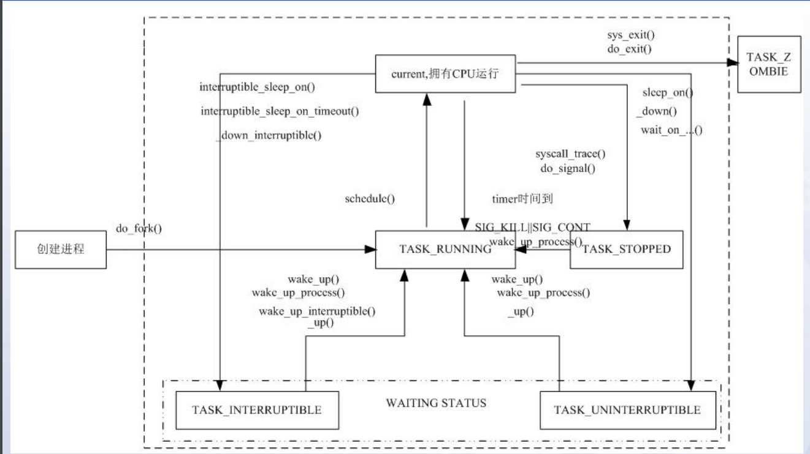

# ARM-Linux内核

### 1. 内存管理

* 影响内存管理的两个方面

  * Linux操作系统的内存管理
  * MMU
* 内存管理内容

  * 地址映射、内存空间分配
  * I/O地址的映射
  * 代码段、数据段、堆栈段空间的分配
  * 地址访问限制(保护机制)
* MMU

  * 内存管理单元
    * 功能：地址映射/对地址访问的保护和限制
  * MMU可以做在芯片中，也可以作为协处理器

### 2. 进程管理和调度

* 什么是进程
  * 资源分配和调度的基本单位
  * 是程序的实体
  * 
* 进程的创建
  * sys_fork：完整派生
  * sys_clone：通过参数复制资源
  * sys_vfork：复制task_struct，其他共享，阻塞父进程
* 进程的执行
  * fork：创建一个子进程，是父进程的拷贝
  * exec：不创建进程，而是替换当前进程内容
* 进程的销毁
  * do_exit()
    * 释放资源，状态设置为TASK_ZOMBIE
  * 致命信号
  * 父进程销毁
* 进程调度依据
  * Policy：
    * 调度策略，区分实时进程和普通进程
    * 实时进程优先于普通进程运行
  * Priority：进程的静态优先级
  * Counter：
    * 进程剩余时间片，起始值为Priority的值
    * 可看作进程动态优先级
  * rt_priority：实时进程特有，用于实时进程间的选择

### 3. 模块机制

* 必要性
  * 弥补了Linux单内核的缺点：可扩展性以及可维护性差
* 模块代码结构
  * 头文件
  * 模块宏声明
  * 初始化函数
  * 退出函数
  * 入口出口函数
* 相关主要命令
  * lsmod：列出kernel中安装的模块
  * insmod：把某个module安装到kernel
  * rmmod：卸载module
  * depmod：制造module dependency file，告诉insmod去哪找modules安装

### 4. 中断

* 流程：中断响应->中断处理->中断返回
* GPIO：通用可编程的I/O接口，每一位都可在程序控制下设置用于输入或输出(输入时可引发中断请求)

### 5. 系统调用

* 实现方式
  * X86：通过自陷指令"INT 80"实现，系统调用号由eax传递，参数通过寄存器传递，返回值通过eax返回
  * ARM：通过自陷指令"SWI"实现，系统调用号是SWI操作数，参数通过寄存器传递，返回值保存至寄存器R0

### 6. 系统启动和初始化

* 过程
  1. 使用bootloader将内核映像载入
  2. 内核数据结构初始化
     * start_kernel()调用一系列初始化函数(例：时间初始化，内存初始化，创建页cache等)
     * 调用init()过程，创建第一个内核线程
  3. 外设初始化
     * init()锁定内核，调用do_basic_setup()完成外设及其驱动的加载和初始化(如总线初始化，网络初始化，设备初始化，文件系统初始化等)
     * 使用execve()系统调用加载执行init程序
     * init()结束后存在六个运行实体：
       * start_kernel()：创建init线程后进入cpu_idle()，不在进程列表中出现
       * init线程：处于用户态，加载init程序
       * kflushd核心线程：由init创建，在核心态运行bdflush()
       * kupdate核心线程：由init创建，在核心态运行kupdate()
       * kswapd核心线程：由init创建，在核心态运行kswapd()
       * keventd核心线程：由init创建，在核心态运行context_thread()
  4. init进程和inittab脚本
     * init进程是系统所有进程起点，进程号为1
     * 通常init进程是根目录下的linuxrc脚本文件
       * /sbin/init程序读取/etc/inittab文件
       * inittab是以行为单位的描述性(非执行性)文本
       * inittab每一个指令行有格式：id:runlevel:action:process
       * rc启动脚本：激活交换分区、检查磁盘、加载硬件模块
  5. Shell启动

### 7. 嵌入式Linux内核编译

1. Linux内核配置
   * make config：基于文本的命令行界面
   * make menuconfig：基于文本的图形界面
   * make xconfig：基于图形窗口的配置界面
2. Linux内核编译
   * make：通过执行Makefile构建内核，并生成未压缩的内核映像文件vmlinux和其他相关文件
   * make zImage：在make的基础上，进一步生成压缩的内核映像文件zImage
   * make bzImage：在make的基础上生成压缩的内核映像文件bzImage(比zImage大)
3. 内核下载和烧写
