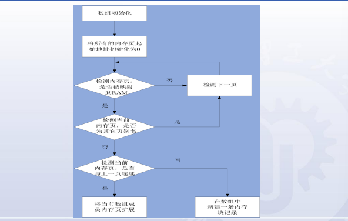

1. 建立引导装载程序Bootloader

* PC机和嵌入式系统的启动过程及其差别
    * PC：系统加电->系统BIOS检测并启动控制卡上的BIOS->将硬盘MBR中的Boot Loader读入系统RAM->交给OS Boot Loader控制->
      将内核映像从硬盘读入RAM->跳转到内核入口点
    * 嵌入式：加电->引导加载程序(BootLoader等)->操作系统内核->加载文件系统->运行用户程序
* 什么是BootLoader：
    * 操作系统内核运行之前运行的一小段程序
    * 目的：从操作系统角度看，正确调用内核来执行
    * 常见的BootLoader：
        * ROM BootLoader，BIOS BootLoader(x86)
        * U-boot(通用BootLoader)
* 主要工作
    * 初始化硬件设备和建立内存空间映射图
    * 将系列的软硬件环境带到一个合适的状态
    * 为最终调用操作系统内核准备好正确的环境
* 操作模式：
    * 启动加载模式:
        * 自主模式，是BootLoader的正常工作模式
    * 下载模式：
        * 用户干预进入下载模式，在控制台打印提示信息，等待用户输入(不干预则进入启动加载模式)
        * 可通过串口连接或网络连接等通信手段从主机下载文件
            * 如何使用串口终端
        * 通常在第一次安装内核与根文件系统时/系统更新被调用
        * 流程：
            * 下载的文件被BootLoader保存到目标机的RAM上
            * 被BootLoader写到目标机的FLASH列固态存储设备中，或者直接在RAM中运行
* 与主机间的通信协议和设备
    * 串口，协议xmodem/ymodem/zmodem
    * 以太网，协议TFTP
* BootLoader阶段
    * 阶段一：实现依赖与CPU体系结构的代码(汇编)
        1. 硬件设备初始化
        2. 为加载阶段2准备RAM空间
        3. 拷贝阶段2到RAM中
        4. 设置堆栈指针sp
        5. 跳转到阶段2的C入口点
    * 阶段二：实现一些复杂的功能(C语言)
        1. 初始化本阶段要使用的硬件设备
        2. 检测系统的内存映射
        3. 加载内核映像和根文件系统映像
        4. 设置内核启动参数
        5. 调用内核
* 烧写BootLoader
    * 烧写方法：串口
* 加载或烧写内核和文件系统
    * 编程：
        * trampoline:
            * 流程：
                1. 汇编编写，作为stage2的入口点
                2. 在trampoline中用CPU跳转指令跳入main()函数中执行
                3. main()返回后，cpu执行路径回到trampoline
            * 原因：
                * 无法向main()函数传递参数/无法处理函数返回
                * 相当于main()的外部包裹(external wrapper)
* 如何检测内存可读写： 
  
* 与内核的通信
    * 启动参数
        * 以标记列表(tagged list)的形式来传递启动参数
        * tagged list以标记ATAG_CORE开始,ATAG_NONE结束
        * 标记由tag_header结构(标识被传递参数)以及随后的参数值数据结构组成
        * 嵌入式Linux中，常见启动参数：
            * ATAG_CORE
            * ATAG_MEM
            * ATAG_CMDLINE
            * ATAG_RAMDISK
            * ATAG_INITRD
    * 跳转：
        * 直接跳转到内核第一条指令处
        * 跳转条件：
            * CPU寄存器设置：R0=0; R1=机器类型; R2=启动参数标记列表在RAM中起始基地址
            * CPU模式：禁止中断; svc模式
            * Cache和MMU设置：MMU关闭; 数据Cache关闭
